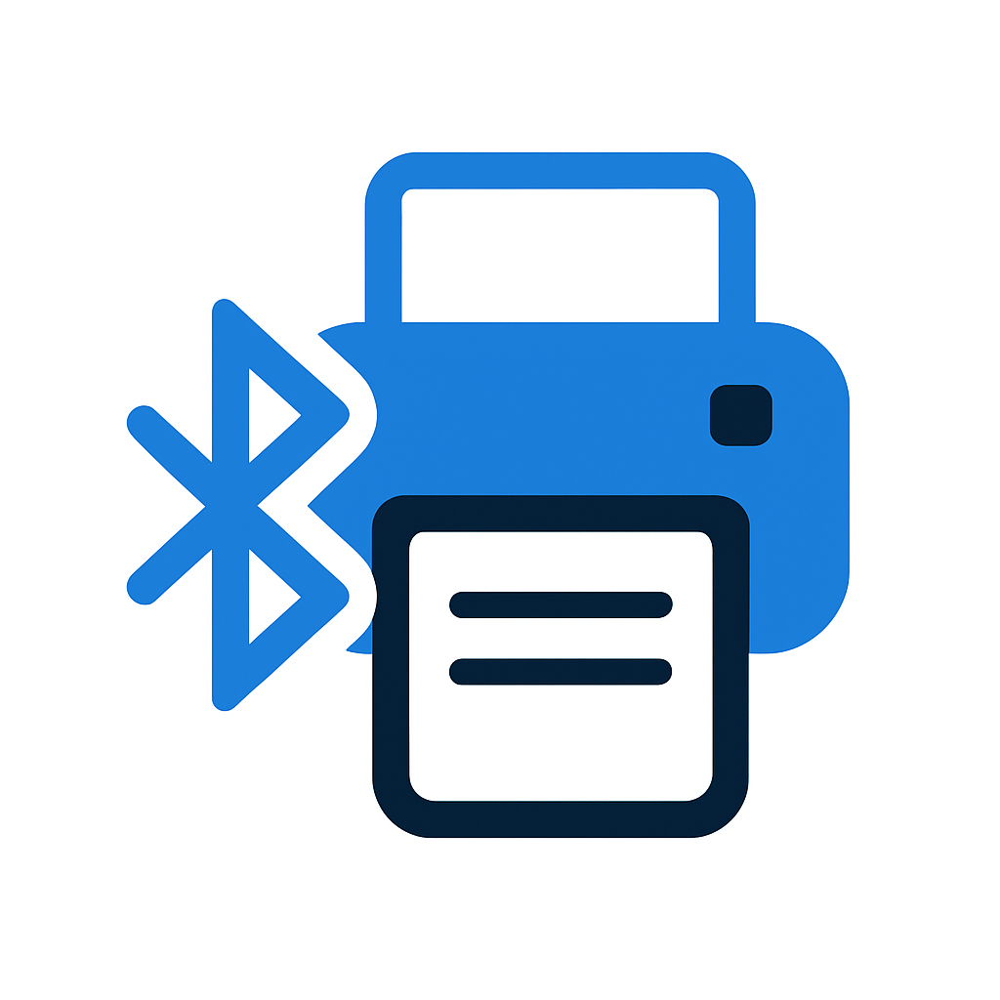

# MAUI Bluetooth Printer Utils

<div align="center">



**Cross-platform Bluetooth printer library for .NET MAUI**

[](https://www.nuget.org/packages/Maui.Bluetooth.Utils)
[](LICENSE)
[](https://dotnet.microsoft.com/apps/maui)

</div>

## 📋 Table of Contents

- [Features](#features)
- [Supported Printers](#supported-printers)
- [Installation](#installation)
- [Quick Start](#quick-start)
- [Usage Guide](#usage-guide)
- [ESC/POS Printers](#escpos-printers)
- [Zebra Printers](#zebra-printers)
- [Platform Configuration](#platform-configuration)
- [API Reference](#api-reference)
- [Examples](#examples)
- [Contributing](#contributing)
- [License](#license)

## ✨ Features

### 🔧 Core Features
- **Cross-platform** Android and iOS support
- **ESC/POS** protocol support (thermal printers)
- **Zebra ZPL/CPCL** protocol support (label printers)
- **Generic Bluetooth** printer support
- **Dependency Injection** support
- **Event-driven** architecture
- **Async/await** pattern support

### 🚀 Advanced Features
- **Automatic device discovery** and connection management
- **Print job queue** system
- **Printer status monitoring**
- **Connection retry** mechanism
- **Memory leak** protection
- **Thread-safe** operations
- **Error handling** and logging

### 🛡️ Security and Performance
- **Bluetooth permissions** management
- **Connection timeout** settings
- **Battery optimization** support
- **Memory optimization** techniques
- **Exception handling** strategies

## 🖨️ Supported Printers

### ESC/POS Printers
ESC/POS printers are the standard protocol for thermal printers. These printers are typically used for receipts, invoices, and small labels.

### ESC/POS Printer Features
- **Thermal printing** technology
- **Cutting** capability (partial/full cut)
- **Paper feed** control
- **Font** and **size** settings
- **Alignment** options
- **Bitmap** printing support

### ESC/POS Printer Usage

#### 1. Basic Printing
```csharp
// Simple text printing
await _escPosService.PrintAsync(new PrintDataModel 
{ 
    Content = "Hello World!" 
});

// Print with alignment
await _escPosService.PrintAsync(new PrintDataModel 
{ 
    Content = "Centered Text",
    Alignment = TextAlignment.Center 
});
```

#### 2. Advanced Printing Features
```csharp
// Double height text
await _escPosService.PrintDoubleHeightTextAsync("LARGE TEXT", TextAlignment.Center);

// Double width text
await _escPosService.PrintDoubleWidthTextAsync("WIDE TEXT", TextAlignment.Center);

// Double size text (both height and width)
await _escPosService.PrintDoubleSizeTextAsync("LARGE AND WIDE", TextAlignment.Center);

// Inverted text
await _escPosService.PrintInvertedTextAsync("INVERTED TEXT", TextAlignment.Center);

// Upside down text
await _escPosService.PrintUpsideDownTextAsync("UPSIDE DOWN", TextAlignment.Center);
```

#### 3. Font and Style Settings
```csharp
// Print with custom font (font number 0-9)
await _escPosService.PrintTextWithFontAsync("Custom Font", 1, TextAlignment.Left);

// Set character code page
await _escPosService.SetCodePageAsync(437); // US-ASCII

// Set print density
await _escPosService.SetPrintDensityAsync(10); // 0-15 range

// Set print speed
await _escPosService.SetPrintSpeedAsync(2); // 0-3 range
```

#### 4. Paper Control
```csharp
// Feed paper forward
await _escPosService.FeedPaperAsync(3); // 3 lines forward

// Feed paper backward
await _escPosService.FeedPaperBackwardAsync(1); // 1 line backward

// Partial cut
await _escPosService.PartialCutAsync();

// Full cut
await _escPosService.FullCutAsync();
```

#### 5. Bitmap Printing
```csharp
// Print bitmap
var imageData = File.ReadAllBytes("logo.png");
await _escPosService.PrintBitmapAsync(imageData, 384, 200, 0);
```

#### 6. Complete ESC/POS Example
```csharp
public async Task PrintReceiptAsync()
{
    try
    {
        // Initialize printer
        await _escPosService.InitializeEscPosAsync();
        
        // Header
        await _escPosService.PrintDoubleSizeTextAsync("STORE NAME", TextAlignment.Center);
        await _escPosService.FeedPaperAsync(1);
        
        // Date and time
        var now = DateTime.Now;
        await _escPosService.PrintAsync(new PrintDataModel 
        { 
            Content = $"Date: {now:dd.MM.yyyy}", 
            Alignment = TextAlignment.Left 
        });
        await _escPosService.PrintAsync(new PrintDataModel 
        { 
            Content = $"Time: {now:HH:mm:ss}", 
            Alignment = TextAlignment.Left 
        });
        await _escPosService.FeedPaperAsync(1);
        
        // Separator line
        await _escPosService.PrintAsync(new PrintDataModel 
        { 
            Content = "--------------------------------", 
            Alignment = TextAlignment.Center 
        });
        
        // Product list
        await _escPosService.PrintAsync(new PrintDataModel 
        { 
            Content = "Product 1                   10.00 TL", 
            Alignment = TextAlignment.Left 
        });
        await _escPosService.PrintAsync(new PrintDataModel 
        { 
            Content = "Product 2                   15.50 TL", 
            Alignment = TextAlignment.Left 
        });
        
        await _escPosService.FeedPaperAsync(1);
        
        // Total
        await _escPosService.PrintDoubleHeightTextAsync("TOTAL: 25.50 TL", TextAlignment.Right);
        
        await _escPosService.FeedPaperAsync(3);
        
        // Thank you message
        await _escPosService.PrintAsync(new PrintDataModel 
        { 
            Content = "Thank you!", 
            Alignment = TextAlignment.Center 
        });
        
        // Cut paper
        await _escPosService.PartialCutAsync();
    }
    catch (Exception ex)
    {
        Console.WriteLine($"Printing error: {ex.Message}");
    }
}
```

### Zebra Printers
Zebra printers are specifically designed for label printing. They use ZPL (Zebra Programming Language) and CPCL (Comtec Printer Control Language) protocols.

### Zebra Printer Features
- **Label printing** technology
- **Barcode** and **QR code** support
- **Graphics** printing
- **Font** and **size** settings
- **Calibration** capability
- **Status monitoring**

### Zebra Printer Usage

#### 1. Basic ZPL Printing
```csharp
// Simple ZPL label
var zplCommands = @"
^XA
^FO50,50^A0N,50,50^FDHello World^FS
^XZ";

await _zebraService.PrintLabelAsync(zplCommands);
```

#### 2. Template Printing
```csharp
// ZPL template
var template = @"
^XA
^FO50,50^A0N,30,30^FD{ProductName}^FS
^FO50,100^A0N,25,25^FD{Price}^FS
^FO50,150^BY3^BCN,100,Y,N,N^FD{Barcode}^FS
^XZ";

// Template data
var data = new Dictionary<string, string>
{
    { "ProductName", "Test Product" },
    { "Price", "99.99 TL" },
    { "Barcode", "123456789" }
};

await _zebraService.PrintLabelWithDataAsync(template, data);
```

#### 3. Printer Settings
```csharp
// Set print darkness (0-30)
await _zebraService.SetPrintDarknessAsync(15);

// Set print speed (1-14)
await _zebraService.SetPrintSpeedAsync(3);

// Set label dimensions
await _zebraService.SetLabelDimensionsAsync(384, 200); // width, length (dots)
```

#### 4. Printer Status
```csharp
// Check printer status
var status = await _zebraService.GetPrinterStatusAsync();
if (status.IsReady)
{
    Console.WriteLine("Printer is ready");
}
else
{
    Console.WriteLine($"Printer error: {status.ErrorMessage}");
}

// Check if printer is ready
var isReady = await _zebraService.IsPrinterReadyAsync();
```

#### 5. Calibration and Testing
```csharp
// Calibrate printer
await _zebraService.CalibratePrinterAsync();

// Print test label
await _zebraService.PrintTestLabelAsync();
```

#### 6. Complete Zebra Example
```csharp
public async Task PrintProductLabelAsync(string productName, string price, string barcode)
{
    try
    {
        // Check printer status
        if (!await _zebraService.IsPrinterReadyAsync())
        {
            throw new Exception("Printer is not ready");
        }

        // ZPL commands
        var zplCommands = $@"
^XA
^MMT
^PW384
^LL200
^LS0
^FO50,30^A0N,40,40^FD{productName}^FS
^FO50,80^A0N,30,30^FD{price}^FS
^FO50,130^BY3^BCN,100,Y,N,N^FD{barcode}^FS
^FO50,240^A0N,20,20^FD{DateTime.Now:dd.MM.yyyy HH:mm}^FS
^XZ";

        // Print label
        await _zebraService.PrintLabelAsync(zplCommands);
    }
    catch (Exception ex)
    {
        Console.WriteLine($"Zebra printing error: {ex.Message}");
    }
}
```

#### 7. Barcode and QR Code Examples
```csharp
// Code 128 Barcode
var code128Zpl = @"
^XA
^FO50,50^BY3^BCN,100,Y,N,N^FD123456789^FS
^XZ";

// QR Code
var qrCodeZpl = @"
^XA
^FO50,50^BQN,2,5^FD123456789^FS
^XZ";

// Data Matrix
var dataMatrixZpl = @"
^XA
^FO50,50^BX,5,200^FD123456789^FS
^XZ";

await _zebraService.PrintLabelAsync(code128Zpl);
```

## 🔧 Platform Configuration

### Android Configuration

#### AndroidManifest.xml
```xml
<?xml version="1.0" encoding="utf-8"?>
<manifest xmlns:android="http://schemas.android.com/apk/res/android">
    <!-- Bluetooth permissions -->
    <uses-permission android:name="android.permission.BLUETOOTH" />
    <uses-permission android:name="android.permission.BLUETOOTH_ADMIN" />
    <uses-permission android:name="android.permission.BLUETOOTH_CONNECT" />
    <uses-permission android:name="android.permission.BLUETOOTH_SCAN" />
    <uses-permission android:name="android.permission.ACCESS_FINE_LOCATION" />
    <uses-permission android:name="android.permission.ACCESS_COARSE_LOCATION" />
    
    <!-- Bluetooth features -->
    <uses-feature android:name="android.hardware.bluetooth" android:required="true" />
    <uses-feature android:name="android.hardware.bluetooth_le" android:required="false" />
    
    <application android:allowBackup="true" android:icon="@mipmap/appicon" android:roundIcon="@mipmap/appicon_round" android:supportsRtl="true">
    </application>
</manifest>
```

#### MainActivity.cs
```csharp
using Android.App;
using Android.Content.PM;
using Android.OS;

namespace BluetoothPrinterSample;

[Activity(Theme = "@style/Maui.SplashTheme", MainLauncher = true, ConfigurationChanges = ConfigChanges.ScreenSize | ConfigChanges.Orientation | ConfigChanges.UiMode | ConfigChanges.ScreenLayout | ConfigChanges.SmallestScreenSize | ConfigChanges.Density)]
public class MainActivity : MauiAppCompatActivity
{
    protected override void OnCreate(Bundle? savedInstanceState)
    {
        base.OnCreate(savedInstanceState);
        
        // Initialize Bluetooth adapter
        InitializeBluetooth();
    }
    
    private void InitializeBluetooth()
    {
        // Check Bluetooth adapter
        var bluetoothAdapter = Android.Bluetooth.BluetoothAdapter.DefaultAdapter;
        if (bluetoothAdapter == null)
        {
            // Bluetooth not supported
            return;
        }
        
        if (!bluetoothAdapter.IsEnabled)
        {
            // Bluetooth is disabled, notify user
            var intent = new Android.Content.Intent(Android.Bluetooth.BluetoothAdapter.ActionRequestEnable);
            StartActivityForResult(intent, 1);
        }
    }
}
```

### iOS Configuration

#### Info.plist
```xml
<?xml version="1.0" encoding="UTF-8"?>
<!DOCTYPE plist PUBLIC "-//Apple//DTD PLIST 1.0//EN" "http://www.apple.com/DTDs/PropertyList-1.0.dtd">
<plist version="1.0">
<dict>
    <!-- Bluetooth usage descriptions -->
    <key>NSBluetoothAlwaysUsageDescription</key>
    <string>This app requires Bluetooth access to connect to Bluetooth printers.</string>
    <key>NSBluetoothPeripheralUsageDescription</key>
    <string>This app requires Bluetooth access to connect to Bluetooth printers.</string>
    
    <!-- Location usage (required for Bluetooth scanning on iOS) -->
    <key>NSLocationWhenInUseUsageDescription</key>
    <string>This app requires location access to discover Bluetooth devices.</string>
    <key>NSLocationAlwaysAndWhenInUseUsageDescription</key>
    <string>This app requires location access to discover Bluetooth devices.</string>
</dict>
</plist>
```

#### AppDelegate.cs
```csharp
using Foundation;
using UIKit;

namespace BluetoothPrinterSample;

[Register("AppDelegate")]
public class AppDelegate : MauiUIApplicationDelegate
{
    protected override MauiApp CreateMauiApp() => MauiProgram.CreateMauiApp();
    
    public override bool FinishedLaunching(UIApplication application, NSDictionary launchOptions)
    {
        // Bluetooth permission request
        RequestBluetoothPermission();
        
        return base.FinishedLaunching(application, launchOptions);
    }
    
    private void RequestBluetoothPermission()
    {
        // Bluetooth permission for iOS 13+
        if (UIDevice.CurrentDevice.CheckSystemVersion(13, 0))
        {
            // Bluetooth permission will be requested automatically
        }
    }
}
```

## 📚 API Reference

### IBluetoothService

#### Basic Methods
```csharp
// Check Bluetooth status
Task<bool> IsBluetoothAvailableAsync();

// Request permissions
Task<bool> RequestPermissionsAsync();

// Scan for devices
Task<List<BluetoothDeviceModel>> ScanForDevicesAsync(CancellationToken cancellationToken = default);

// Get paired devices
Task<List<BluetoothDeviceModel>> GetPairedDevicesAsync();

// Connect to device
Task<bool> ConnectAsync(BluetoothDeviceModel device);

// Disconnect
Task<bool> DisconnectAsync();

// Send data
Task<bool> SendDataAsync(byte[] data);

// Get connection state
ConnectionState GetConnectionState();

// Get connected device
BluetoothDeviceModel? GetConnectedDevice();
```

#### Events
```csharp
// Connection state changed
event EventHandler<ConnectionStateChangedEventArgs>? ConnectionStateChanged;

// Device discovered
event EventHandler<BluetoothDeviceModel>? DeviceDiscovered;
```

### IEscPosPrinterService

#### Basic Methods
```csharp
// Initialize printer
Task<bool> InitializeEscPosAsync();

// Print text
Task<bool> PrintAsync(PrintDataModel printData);

// Double height text
Task<bool> PrintDoubleHeightTextAsync(string text, TextAlignment alignment = TextAlignment.Left);

// Double width text
Task<bool> PrintDoubleWidthTextAsync(string text, TextAlignment alignment = TextAlignment.Left);

// Double size text
Task<bool> PrintDoubleSizeTextAsync(string text, TextAlignment alignment = TextAlignment.Left);

// Inverted text
Task<bool> PrintInvertedTextAsync(string text, TextAlignment alignment = TextAlignment.Left);

// Upside down text
Task<bool> PrintUpsideDownTextAsync(string text, TextAlignment alignment = TextAlignment.Left);

// Custom font text
Task<bool> PrintTextWithFontAsync(string text, int font, TextAlignment alignment = TextAlignment.Left);

// Paper feed
Task<bool> FeedPaperAsync(int lines = 1);
Task<bool> FeedPaperBackwardAsync(int lines = 1);

// Paper cut
Task<bool> PartialCutAsync();
Task<bool> FullCutAsync();

// Bitmap printing
Task<bool> PrintBitmapAsync(byte[] imageData, int width, int height, int mode = 0);
```

#### Configuration Methods
```csharp
// Character code page
Task<bool> SetCodePageAsync(int codePage);

// Print density
Task<bool> SetPrintDensityAsync(int density);

// Print speed
Task<bool> SetPrintSpeedAsync(int speed);
```

### IZebraPrinterService

#### Basic Methods
```csharp
// Print ZPL label
Task<bool> PrintLabelAsync(string zplCommands);

// Print with template
Task<bool> PrintLabelWithDataAsync(string template, Dictionary<string, string> data);

// Get printer status
Task<PrinterStatusModel> GetPrinterStatusAsync();

// Check if printer is ready
Task<bool> IsPrinterReadyAsync();

// Calibrate printer
Task<bool> CalibratePrinterAsync();

// Print test label
Task<bool> PrintTestLabelAsync();
```

#### Configuration Methods
```csharp
// Print darkness
Task<bool> SetPrintDarknessAsync(int darkness);

// Print speed
Task<bool> SetPrintSpeedAsync(int speed);

// Label dimensions
Task<bool> SetLabelDimensionsAsync(int width, int length);

// Get printer settings
Task<PrinterSettingsModel> GetPrinterSettingsAsync();
```

#### Events
```csharp
// Printer status changed
event EventHandler<PrinterStatusChangedEventArgs>? PrinterStatusChanged;
```

## 💡 Examples

### Complete Application Example

#### MainPage.xaml
```xml
<?xml version="1.0" encoding="utf-8" ?>
<ContentPage xmlns="http://schemas.microsoft.com/dotnet/2021/maui"
             xmlns:x="http://schemas.microsoft.com/winfx/2009/xaml"
             x:Class="BluetoothPrinterSample.MainPage">

    <ScrollView>
        <VerticalStackLayout Spacing="25" Padding="30,0" VerticalOptions="Center">

            <Label 
                Text="Bluetooth Printer Example"
                SemanticProperties.HeadingLevel="Level1"
                FontSize="32"
                HorizontalOptions="Center" />

            <Label 
                x:Name="StatusLabel"
                Text="Connection Status: Not Connected"
                SemanticProperties.Description="Bluetooth connection status"
                FontSize="18"
                HorizontalOptions="Center" />

            <Button 
                x:Name="ScanButton"
                Text="Scan Devices"
                SemanticProperties.Hint="Scans for Bluetooth devices"
                Clicked="OnScanButtonClicked"
                HorizontalOptions="Center" />

            <Button 
                x:Name="ConnectButton"
                Text="Connect"
                SemanticProperties.Hint="Connects to selected device"
                Clicked="OnConnectButtonClicked"
                HorizontalOptions="Center" />

            <Button 
                x:Name="DisconnectButton"
                Text="Disconnect"
                SemanticProperties.Hint="Disconnects from device"
                Clicked="OnDisconnectButtonClicked"
                HorizontalOptions="Center" />

            <Label 
                Text="Discovered Devices:"
                SemanticProperties.HeadingLevel="Level2"
                FontSize="20"
                HorizontalOptions="Center" />

            <ListView 
                x:Name="DeviceListView"
                SelectionMode="Single"
                SelectedItemChanged="OnDeviceSelected"
                HeightRequest="200">
                <ListView.ItemTemplate>
                    <DataTemplate>
                        <ViewCell>
                            <Grid Padding="10">
                                <Grid.RowDefinitions>
                                    <RowDefinition Height="Auto"/>
                                    <RowDefinition Height="Auto"/>
                                </Grid.RowDefinitions>
                                <Grid.ColumnDefinitions>
                                    <ColumnDefinition Width="*"/>
                                    <ColumnDefinition Width="Auto"/>
                                </Grid.ColumnDefinitions>
                                
                                <Label Grid.Row="0" Grid.Column="0" Text="{Binding Name}" FontSize="16" FontAttributes="Bold"/>
                                <Label Grid.Row="1" Grid.Column="0" Text="{Binding Address}" FontSize="12" TextColor="Gray"/>
                                <Label Grid.Row="0" Grid.Column="1" Grid.RowSpan="2" Text="{Binding PrinterType}" FontSize="12" VerticalOptions="Center"/>
                            </Grid>
                        </ViewCell>
                    </DataTemplate>
                </ListView.ItemTemplate>
            </ListView>

            <Label 
                Text="Printing Tests:"
                SemanticProperties.HeadingLevel="Level2"
                FontSize="20"
                HorizontalOptions="Center" />

            <Button 
                x:Name="PrintTestButton"
                Text="ESC/POS Test Print"
                SemanticProperties.Hint="ESC/POS test printing"
                Clicked="OnPrintTestButtonClicked"
                HorizontalOptions="Center" />

            <Button 
                x:Name="PrintZebraButton"
                Text="Zebra Test Print"
                SemanticProperties.Hint="Zebra test printing"
                Clicked="OnPrintZebraButtonClicked"
                HorizontalOptions="Center" />

        </VerticalStackLayout>
    </ScrollView>

</ContentPage>
```

#### MainPage.xaml.cs
```csharp
using Maui.Bluetooth.Utils.Shared.Interfaces;
using Maui.Bluetooth.Utils.Shared.Models;

namespace BluetoothPrinterSample;

public partial class MainPage : ContentPage
{
    private readonly IBluetoothService _bluetoothService;
    private readonly IEscPosPrinterService _escPosService;
    private readonly IZebraPrinterService _zebraService;
    private BluetoothDeviceModel? _selectedDevice;

    public MainPage(IBluetoothService bluetoothService, 
                   IEscPosPrinterService escPosService,
                   IZebraPrinterService zebraService)
    {
        InitializeComponent();
        _bluetoothService = bluetoothService;
        _escPosService = escPosService;
        _zebraService = zebraService;

        // Event handlers
        _bluetoothService.ConnectionStateChanged += OnConnectionStateChanged;
        _bluetoothService.DeviceDiscovered += OnDeviceDiscovered;

        // Button states
        UpdateButtonStates();
    }

    private void UpdateButtonStates()
    {
        var isConnected = _bluetoothService.GetConnectionState() == ConnectionState.Connected;
        ConnectButton.IsEnabled = _selectedDevice != null && !isConnected;
        DisconnectButton.IsEnabled = isConnected;
        PrintTestButton.IsEnabled = isConnected;
        PrintZebraButton.IsEnabled = isConnected;
    }

    private async void OnScanButtonClicked(object sender, EventArgs e)
    {
        try
        {
            ScanButton.IsEnabled = false;
            ScanButton.Text = "Scanning...";

            // Check Bluetooth permissions
            if (!await _bluetoothService.RequestPermissionsAsync())
            {
                await DisplayAlert("Error", "Bluetooth permissions required", "OK");
                return;
            }

            // Scan for devices
            var devices = await _bluetoothService.ScanForDevicesAsync();
            DeviceListView.ItemsSource = devices;
        }
        catch (Exception ex)
        {
            await DisplayAlert("Error", ex.Message, "OK");
        }
        finally
        {
            ScanButton.IsEnabled = true;
            ScanButton.Text = "Scan Devices";
        }
    }

    private async void OnConnectButtonClicked(object sender, EventArgs e)
    {
        if (_selectedDevice == null) return;

        try
        {
            ConnectButton.IsEnabled = false;
            ConnectButton.Text = "Connecting...";

            var connected = await _bluetoothService.ConnectAsync(_selectedDevice);
            if (connected)
            {
                await DisplayAlert("Success", $"Connected to {_selectedDevice.Name}", "OK");
            }
            else
            {
                await DisplayAlert("Error", "Connection failed", "OK");
            }
        }
        catch (Exception ex)
        {
            await DisplayAlert("Error", ex.Message, "OK");
        }
        finally
        {
            UpdateButtonStates();
            ConnectButton.Text = "Connect";
        }
    }

    private async void OnDisconnectButtonClicked(object sender, EventArgs e)
    {
        try
        {
            var disconnected = await _bluetoothService.DisconnectAsync();
            if (disconnected)
            {
                await DisplayAlert("Success", "Disconnected", "OK");
            }
        }
        catch (Exception ex)
        {
            await DisplayAlert("Error", ex.Message, "OK");
        }
        finally
        {
            UpdateButtonStates();
        }
    }

    private void OnDeviceSelected(object sender, SelectedItemChangedEventArgs e)
    {
        _selectedDevice = e.SelectedItem as BluetoothDeviceModel;
        UpdateButtonStates();
    }

    private async void OnPrintTestButtonClicked(object sender, EventArgs e)
    {
        try
        {
            await PrintEscPosTestAsync();
        }
        catch (Exception ex)
        {
            await DisplayAlert("Printing Error", ex.Message, "OK");
        }
    }

    private async void OnPrintZebraButtonClicked(object sender, EventArgs e)
    {
        try
        {
            await PrintZebraTestAsync();
        }
        catch (Exception ex)
        {
            await DisplayAlert("Printing Error", ex.Message, "OK");
        }
    }

    private async Task PrintEscPosTestAsync()
    {
        // ESC/POS test printing
        await _escPosService.InitializeEscPosAsync();
        
        await _escPosService.PrintDoubleSizeTextAsync("TEST PRINTING", TextAlignment.Center);
        await _escPosService.FeedPaperAsync(1);
        
        await _escPosService.PrintAsync(new PrintDataModel 
        { 
            Content = $"Date: {DateTime.Now:dd.MM.yyyy HH:mm:ss}", 
            Alignment = TextAlignment.Left 
        });
        
        await _escPosService.FeedPaperAsync(2);
        await _escPosService.PartialCutAsync();
    }

    private async Task PrintZebraTestAsync()
    {
        // Zebra test printing
        var zplCommands = @"
^XA
^FO50,50^A0N,50,50^FDZEBRA TEST^FS
^FO50,120^A0N,30,30^FDTest Label^FS
^FO50,170^BY3^BCN,100,Y,N,N^FD123456789^FS
^XZ";

        await _zebraService.PrintLabelAsync(zplCommands);
    }

    private void OnConnectionStateChanged(object? sender, ConnectionStateChangedEventArgs e)
    {
        MainThread.BeginInvokeOnMainThread(() =>
        {
            switch (e.CurrentState)
            {
                case ConnectionState.Connected:
                    StatusLabel.Text = "Connection Status: Connected";
                    StatusLabel.TextColor = Colors.Green;
                    break;
                case ConnectionState.Disconnected:
                    StatusLabel.Text = "Connection Status: Not Connected";
                    StatusLabel.TextColor = Colors.Red;
                    break;
                case ConnectionState.Connecting:
                    StatusLabel.Text = "Connection Status: Connecting...";
                    StatusLabel.TextColor = Colors.Orange;
                    break;
                case ConnectionState.Failed:
                    StatusLabel.Text = $"Connection Status: Error - {e.ErrorMessage}";
                    StatusLabel.TextColor = Colors.Red;
                    break;
            }
            
            UpdateButtonStates();
        });
    }

    private void OnDeviceDiscovered(object? sender, BluetoothDeviceModel device)
    {
        MainThread.BeginInvokeOnMainThread(() =>
        {
            var devices = DeviceListView.ItemsSource as List<BluetoothDeviceModel> ?? new List<BluetoothDeviceModel>();
            if (!devices.Any(d => d.Address == device.Address))
            {
                devices.Add(device);
                DeviceListView.ItemsSource = null;
                DeviceListView.ItemsSource = devices;
            }
        });
    }
}
```

## 🤝 Contributing

To contribute to this project:

1. **Fork** the repository
2. **Create** a feature branch (`git checkout -b feature/amazing-feature`)
3. **Commit** your changes (`git commit -m 'feat: Add amazing feature'`)
4. **Push** to the branch (`git push origin feature/amazing-feature`)
5. **Open** a Pull Request

### Development Guidelines
- Apply **SOLID** principles
- Follow **Clean Code** practices
- Write **unit tests**
- Add **XML documentation**
- Maintain **cross-platform** compatibility

### Commit Message Format
```
type: description

feat: New feature
fix: Bug fix
docs: Documentation update
style: Code formatting
refactor: Code refactoring
test: Test addition/modification
chore: Build/deployment changes
```

## 📄 License

This project is licensed under the MIT License. See the [LICENSE](LICENSE) file for details.

## 📞 Contact

- **GitHub**: [@bestekarx](https://github.com/bestekarx)
- **Project**: [Maui.Bluetooth.Utils](https://github.com/bestekarx/Maui.Bluetooth.Utils)

## 🙏 Acknowledgments

This project is inspired by the following open source projects:

- [.NET MAUI](https://dotnet.microsoft.com/apps/maui)
- [Zebra Link-OS SDK](https://developer.zebra.com/)
- [ESC/POS Protocol](https://reference.epson-biz.com/)

---

<div align="center">

**⭐ If you like this project, don't forget to give it a star! ⭐**

</div> 